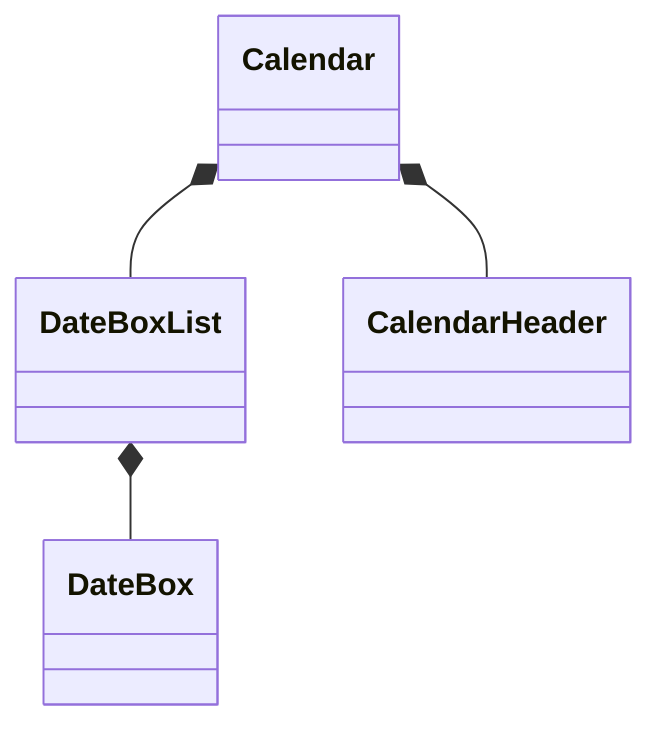

<!-- 最初にTODOリストを整理したい -->

ではまずはどこからコードを書いていきましょうか。
もちろんテストコードから書いていきます。

ではどのテストコードから？
やみくもに実装できるわけではありませんので、おおよそのコンポーネントの設計をしていきましょう。

まず最も大きなコンポーネントとなるCalendarコンポーネントを考えます。

カレンダーには〜年〜月を表す見出しがあるので、これをCalendarHeaderコンポーネントとしましょう。

カレンダーの中には1日を表すセルがいくつも連なっています。
これらは1つ1つのセルをDateBoxコンポーネントとして取り扱いましょう。

これらのDateBoxの連なりを管理するために、DateBoxListを作るようにしましょう。

それを一番上の親となるCalendarに持たせるようにしましょう。
曜日を表示するヘッダーCalendarHeaderコンポーネントについては、別コンポーネントとしてCalendarに持ってもらいましょう。

まとめると、以下のような関係性にしてみようと思います。

