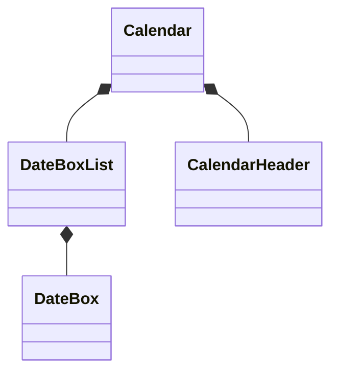

<!-- 最初にTODOリストを整理したい -->


ではまずはどこからコードを書いていきましょうか。
もちろんテストコードから書いていきます。

ではどのテストコードから？
やみくもに実装できるわけではありませんので、おおよそのコンポーネントの設計をしていきましょう。

まず最も大きなコンポーネントとなるCalendarコンポーネントを考えます。

カレンダーには〜年〜月を表す見出しがあるので、これをCalendarHeaderコンポーネントとしましょう。

カレンダーの中には1日を表すセルがいくつも連なっています。
これらは1つ1つのセルをDateBoxコンポーネントとして取り扱いましょう。

これらのDateBoxの連なりを管理ssssするために、DateBoxListを作るようにしましょう。

〜〜である

まとめると、以下のような関係性にしてみようと思います。



おおよそのコンポーネント設計をしたところではじめに戻って、どこからコードを書いていきましょうか。
もちろんテストコードから書いていきます。

この場合、最も明示的なコンポーネントは、もっとの小さなコンポーネントであるDateBoxになりそうです。
こちらのテストコードから書いていきましょう。


`__tests__/components/calendar/DateBox.spec.tsx`を作成し、
テストコードを書いていきます

```ts:DateBox.spec.tsx
import React from 'react';
import { render } from '@testing-library/react';
import { DateBox } from '@/components/calendar/DateBox';

describe('DateBox', () => {
  it('数字の1を渡すと、1が見える', () => {
    const { getByText } = render(<DateBox dateNumber={1} />);
    const dateText = getByText('1');
    expect(dateText).toBeInTheDocument();
  });
});
```

DateBoxコンポーネントに日付を示す数字1を渡すことで、日付の「1」が表示されていることをテストするコードです。

このまま実行すると、そもそもコンポーネントがないのでコンポーネントが見つからないエラーとなります。
テストコードを実行したので、まずはREDにしていきます。


`components/calendar/DateBox.tsx`を新規作成し、REDとなるような実装を書いていきましょう。

```ts:DateBox.tsx
export function DateBox({dateNumber}: {dateNumber: number}) {
    return (
        <div>
            <p></p>
        </div>
    );
};
```


これでコンポーネントをインポート可能になり、想定通りにREDテストが失敗する状態になりました。

---

では、次にGREENにしていきます。

一旦教科書どおりに進めるために、仮実装を使ってとにかくテストが通る状態を作りましょう。


```ts:DateBox.tsx
export function DateBox({dateNumber}: {dateNumber: number}) {
    return (
        <div>
            <p>1</p>
        </div>
    );
};
```

誰が見てもん？となる実装ですが、これで良いのです。
これで「確実に」数字の1が描画されていることがわかります。
試しに実装側の数字を「2」に変えてみましょう。

```ts:DateBox.tsx
export function DateBox({dateNumber}: {dateNumber: number}) {
    return (
        <div>
            <p>2</p>
        </div>
    );
};
```

すると、テストがまた想定通り失敗するはずです。
フロントエンドのテストに慣れていない場合、「このテストコードは正しくテストできているのか？」という場面ばあるかと思います。
そのような場合は、このように実装側を修正することで、テストコードが思ったとおりにバグを検出できるのかどうか、を見てみるよにします。

再びテストに合格するように、数字を戻しておきます。


```ts:DateBox.tsx
export function DateBox({dateNumber}: {dateNumber: number}) {
    return (
        <div>
            <p>1</p>
        </div>
    );
};
```


さて、RED→GREENときたら、次はリファクタリングです。

ただここではリファクタリングはちょっと思いつかなかったです。
いかんせん1人でやっているので…
TDDをする際にペアプロやモブプロを一緒に実践することをお勧めします。
もう1人の目が入ることで、より良い設計を見つけたり、議論することが出来ます。


さて、このままでは数字の1が出てくるだけのコンポーネントになってしまうので、引数で渡された数字に応じて動的に表示する数字を変えたいです。

テストケースを増やしていきましょう。


```diff ts:DateBox.spec.tsx
import React from 'react';
import { render } from '@testing-library/react';
import { DateBox } from '@/components/calendar/DateBox';

describe('DateBox', () => {
  it('数字の1を渡すと、1が見える', () => {
    const { getByText } = render(<DateBox dateNumber={1} />);
    const dateText = getByText('1');
    expect(dateText).toBeInTheDocument();
  });
+
+  it('数字の2を渡すと、2が見える', () => {
+    const { getByText } = render(<DateBox dateNumber={2} />);
+    const dateText = getByText('2');
+    expect(dateText).toBeInTheDocument();
+  });
});
```

これでテストが失敗し、REDな状態になりました。
では実装を修正していきます。


```diff ts:DateBox.tsx
export function DateBox({dateNumber}: {dateNumber: number}) {
    return (
        <div>
-            <p>1</p>
+            <p>{dateNumber}</p>
        </div>
    );
};
```

これで両方のテストケースがGREENになりました。
リファクタリングも、まだコードも小さく、このまますすめてみましょう。


では次に曜日も見えるようにして見ましょう。
まずはテストを書いていきます。

```diff ts:DateBox.spec.tsx
import React from 'react';
import { render } from '@testing-library/react';
import { DateBox } from '@/components/calendar/DateBox';

describe('DateBox', () => {
  it('数字の1を渡すと、1が見える', () => {
    const { getByText } = render(<DateBox dateNumber={1} />);
    const dateText = getByText('1');
    expect(dateText).toBeInTheDocument();
  });

  it('数字の2を渡すと、2が見える', () => {
    const { getByText } = render(<DateBox dateNumber={2} /);
    const dateText = getByText('2');
    expect(dateText).toBeInTheDocument();
  });

+  it('曜日が見える', () => {
+    // テスト書くぞ〜
+  });
});
```

ここではたと、「あれ、そもそもこの設計イケてないな…」と気づきました。
日付と曜日を表示するのはこのDateBoxの責務なので、インターフェースとしてはDate型の値を渡すほうが良さそうです。

ではテストコードを書いていきましょう。


```diff ts:DateBox.spec.tsx
import React from 'react';
import { render } from '@testing-library/react';
import { DateBox } from '@/components/calendar/DateBox';

describe('DateBox', () => {
  it('数字の1を渡すと、1が見える', () => {
    const { getByText } = render(<DateBox dateNumber={1} />);
    const dateText = getByText('1');
    expect(dateText).toBeInTheDocument();
  });

  it('数字の2を渡すと、2が見える', () => {
    const { getByText } = render(<DateBox dateNumber={2} /);
    const dateText = getByText('2');
    expect(dateText).toBeInTheDocument();
  });

  it('日付を指定すると、曜日が見える', () => {
+    const date = new Date("2023-05-21");
+    const { getByText } = render(<DateBox date={date} />);
+    const dayOfWeek = getByText('日');
+    expect(dayOfWeek).toBeInTheDocument();
  });
});
```


ここで、コンポーネントのインターフェースを変えようとしています。
このまま日付のテストケースを実装しようとすると、既存の数字を表示するテストコードが失敗するようになります。

REDとGREENの状態が混在するといけないので、ここで一旦書いたテストケースについて進めることをやめ、既存のテストケースをDate型を使うように修正していきます。
追加した曜日のテストケースは後で使用するので、今はskip句を使うことで、実行対象のテストケースから除外しておきましょう。


```diff ts:DateBox.spec.tsx
import React from 'react';
import { render } from '@testing-library/react';
import { DateBox } from '@/components/calendar/DateBox';

describe('DateBox', () => {
  it('数字の1を渡すと、1が見える', () => {
    const { getByText } = render(<DateBox dateNumber={1} />);
    const dateText = getByText('1');
    expect(dateText).toBeInTheDocument();
  });

  it('数字の2を渡すと、2が見える', () => {
    const { getByText } = render(<DateBox dateNumber={2} /);
    const dateText = getByText('2');
    expect(dateText).toBeInTheDocument();
  });

-  it('日付を指定すると、曜日が見える', () => {
+  it.skip('日付を指定すると、曜日が見える', () => {
    const date = new Date("2023-05-21");
    const { getByText } = render(<DateBox date={date} />);
    const dayOfWeek = getByText('日');
    expect(dayOfWeek).toBeInTheDocument();
  });
});
```

これでskipを除き、すべてのテストがGREENになりました。

この状態で、Date型を利用するように修正していきましょう。
まずはインターフェースを修正し、REDの状態にしましょう。

```diff ts:DateBox.spec.tsx
import React from 'react';
import { render } from '@testing-library/react';
import { DateBox } from '@/components/calendar/DateBox';

describe('DateBox', () => {

-  it('数字の1を渡すと、1が見える', () => {
-    const { getByText } = render(<DateBox dateNumber={1} />);
-    const dateText = getByText('1');
+  it('2023/5/21を渡すと、21が見える', () => {
+    const date = new Date("2023-05-21");
+    const { getByText } = render(<DateBox date={date} />);
+    const dateText = getByText('21');
    expect(dateText).toBeInTheDocument();
  });

-  it('数字の2を渡すと、2が見える', () => {
-    const { getByText } = render(<DateBox dateNumber={2} /);
-    const dateText = getByText('2');
+  it('2024/6/1を渡すと、1が見える', () => {
+    const date = new Date("2024-06-01");
+    const { getByText } = render(<DateBox date={date} />);
+    const dateText = getByText('1');
    expect(dateText).toBeInTheDocument();
  });

  it.skip('日付を指定すると、曜日が見える', () => {
    const date = new Date("2023-05-21");
    const { getByText } = render(<DateBox date={date} />);
    const dayOfWeek = getByText('日');
    expect(dayOfWeek).toBeInTheDocument();
  });
});
```

これでインターフェースをDate型に変える準備が整いました。
それでは実装に入っていきます。GREENにしていきましょう。

