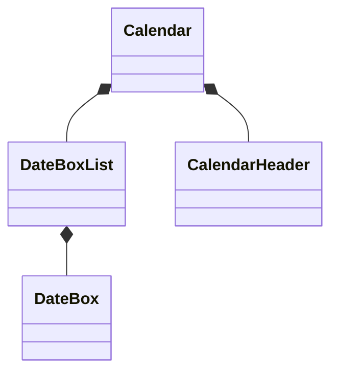

<!-- 最初にTODOリストを整理したい -->

ではまずはどこからコードを書いていきましょうか?
もちろんテストコードから書いていきます。

ではどのテストコードから？
やみくもに実装し始められるわけではありませんので、まず初めにおおよそのUIコンポーネントの設計をしていきましょう。

まず最も大きなコンポーネントとなる**Calendarコンポーネント**を作るようことにしましょう。

カレンダーには〜年〜月を表す見出しがあるので、これを**CalendarHeaderコンポーネント**としましょう。

カレンダーの中には1日を表すセルがいくつも連なっています。
これらは1つ1つのセルを**DateBoxコンポーネント**として取り扱いましょう。

これらのDateBoxの連なりを表現するために、**DateBoxList**を作るようにしましょう。

それを一番上の親となるCalendarに持たせるようにしましょう。
曜日を表示するヘッダーCalendarHeaderコンポーネントについては、別コンポーネントとしてCalendarに持ってもらいましょう。

まとめると、以下のような関係性に実装に進んでみようと思います。

