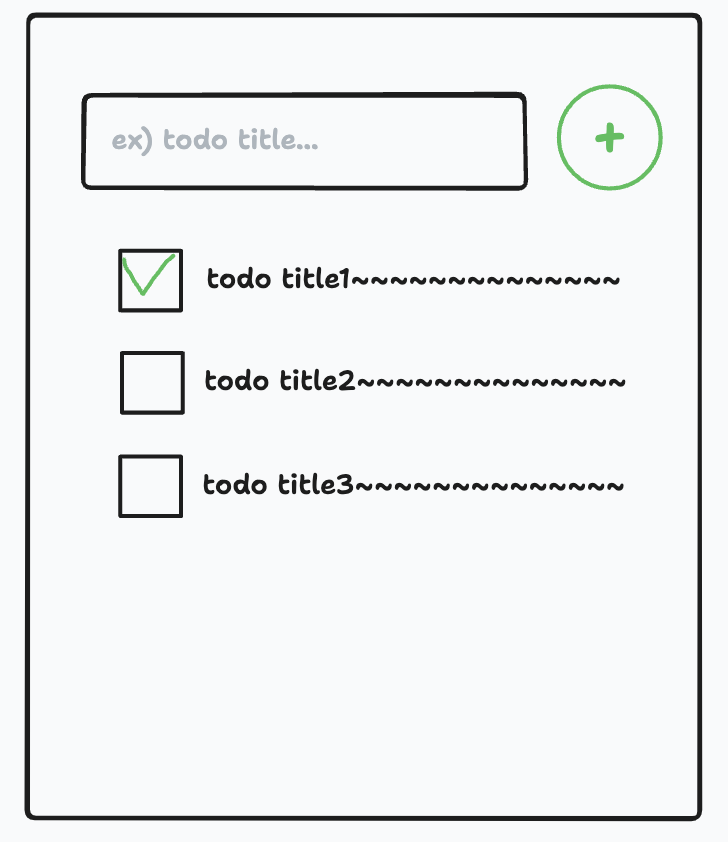
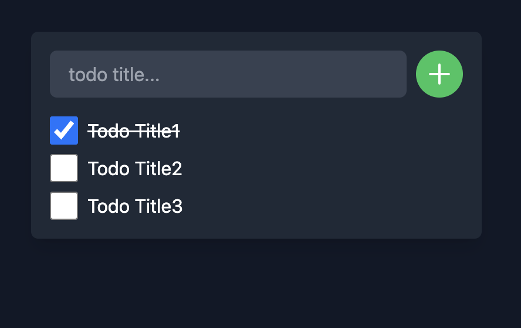

少しUIを整えてみましょう。

# UIイメージを手書きから作ろう

初心者でも作成できるように、お絵描きして自分のイメージのUIを作って行くようにしましょう。

手書きのイメージからUIイメージを起こしてくれる[makereal.tldraw.com](https://github.com/tldraw/make-real)を使いましょう。

詳細は[ブログ](https://tldraw.substack.com/p/make-real-the-story-so-far)を確認ください。

まずは手書きでイケてるUIを書きましょう。

大変イケてますね。

これをAIパワーで更にイケてるUIにしましょう。
「Make Real」ボタンをクリックするだけUIイメージを生成してくれます。

イメージが生成されました。負けずとも劣らないUIです。
UIイメージとしてはこれに近づけるようにしましょう。

# ChatGPTを使ってUIを開発する。

GitHub Copilotが画像イメージの読み込みをしてくれるか分からなかったので、
ChatGPTを使っていきます。

WIP

